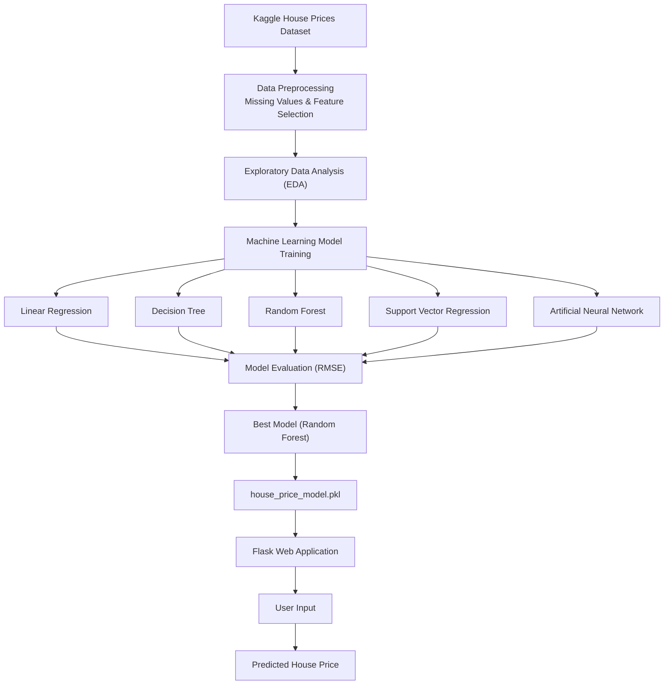

```mermaid
flowchart TD

A["Kaggle House Prices Dataset"]
B["Data Preprocessing<br>Missing Values & Feature Selection"]
C["Exploratory Data Analysis (EDA)"]
D["Machine Learning Model Training"]

E["Linear Regression"]
F["Decision Tree"]
G["Random Forest"]
H["Support Vector Regression"]
I["Artificial Neural Network"]

J["Model Evaluation (RMSE)"]
K["Best Model (Random Forest)"]
L["house_price_model.pkl"]
M["Flask Web Application"]
N["User Input"]
O["Predicted House Price"]

A --> B
B --> C
C --> D

D --> E
D --> F
D --> G
D --> H
D --> I

E --> J
F --> J
G --> J
H --> J
I --> J

J --> K
K --> L
L --> M
M --> N
N --> O
```